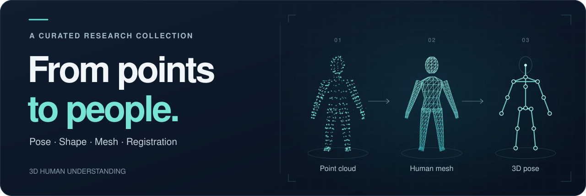

<p align="center">
  
</p>

<h1 align="center">Awesome Point Cloud Human Reconstruction</h1>

<p align="center">
  A curated collection of research on human pose, shape, mesh, and registration from point clouds.
</p>

<p align="center">
  <a href="https://awesome.re"></a>
  <a href="https://github.com/cqs0925/Awesome-PointCloud-Human-Reconstruction/stargazers"></a>
  <a href="https://github.com/cqs0925/Awesome-PointCloud-Human-Reconstruction/forks"></a>
  <a href="https://github.com/cqs0925/Awesome-PointCloud-Human-Reconstruction/issues"></a>
  <a href="LICENSE"></a>
  <a href="https://github.com/cqs0925/Awesome-PointCloud-Human-Reconstruction/commits/main"></a>
  <a href="https://github.com/cqs0925/Awesome-PointCloud-Human-Reconstruction/pulls"></a>
</p>

<p align="center">
  <strong>47 papers</strong> &nbsp;·&nbsp; 2019–2026 &nbsp;·&nbsp; 7 data sources
</p>

<p align="center">
  <a href="#overview">Browse by year</a> &nbsp; / &nbsp;
  <a href="#data-sources">Data-source legend</a> &nbsp; / &nbsp;
  <a href="#contributing">Contribute</a>
</p>

---

> **Scope.** Methods using LiDAR, depth cameras, mmWave radar, body scans, and motion-capture data, alongside related RGB-based human reconstruction and general 3D point-cloud works.

## Overview

| Year | Papers | Venues |
| :--- | ---: | :--- |
| [**2026**](#2026) | 11 | [ICLR](#2026-iclr) · [CVPR](#2026-cvpr) · [ECCV](#2026-eccv) · [SIGGRAPH Asia](#2026-siggraph-asia) · [Journals](#2026-journal-papers) |
| [**2025**](#2025) | 11 | [WACV](#2025-wacv) · [AAAI](#2025-aaai) · [ICLR](#2025-iclr) · [CVPR](#2025-cvpr) · [ICCV](#2025-iccv) · [MM](#2025-mm) · [BMVC](#2025-bmvc) · [Journals](#2025-journal-papers) |
| [**2024**](#2024) | 5 | [CVPR](#2024-cvpr) · [ECCV](#2024-eccv) · [SIGGRAPH Asia](#2024-siggraph-asia) |
| [**2023**](#2023) | 5 | [CVPR](#2023-cvpr) · [ICCV](#2023-iccv) · [SIGGRAPH Asia](#2023-siggraph-asia) |
| [**2022**](#2022) | 3 | [CVPR](#2022-cvpr) · [SIGGRAPH](#2022-siggraph) · [ECCV](#2022-eccv) |
| [**2021**](#2021) | 4 | [CVPR](#2021-cvpr) · [ICCV](#2021-iccv) · [MM](#2021-mm) · [arXiv](#2021-arxiv-papers) |
| [**2020**](#2020) | 4 | [CVPR](#2020-cvpr) · [ECCV](#2020-eccv) · [NeurIPS](#2020-neurips) |
| [**2019**](#2019) | 4 | [ICRA](#2019-icra) · [CVPR](#2019-cvpr) · [ICCV](#2019-iccv) · [Journals](#2019-journal-papers) |

## Data sources

Each paper is tagged with the data source(s) used in its experiments. A paper can have more than one tag.

<details>
<summary><strong>View the data-source legend</strong></summary>

| Badge | Meaning |
| :--- | :--- |
|  | Real LiDAR point clouds (e.g., LiDARHuman26M, SLOPER4D, Waymo, FreeMotion) |
|  | Depth cameras / RGB-D (Kinect, RealSense, ToF), including point clouds back-projected from depth |
|  | mmWave radar |
|  | 3D body scans or multi-view reconstructions (e.g., FAUST, DFAUST, CAPE, 4D-Dress, BUFF, RenderPeople) |
|  | Optical-marker mocap point clouds, or point clouds synthesized from mocap motion (e.g., AMASS, CMU) |
|  | Simulated or rendered data (e.g., SURREAL, NoiseMotion, BEDLAM, ModelNet/ShapeNet CAD, simulated garments) |
|  | Image-only input (monocular or multi-view RGB); 3D is predicted, no point-cloud sensor |
|  | Source could not be verified from the paper |

</details>

**Resource links:** **Paper** — official PDF / proceedings · **arXiv** — preprint · **Project** — project page · **Code** — source · **DOI** — publisher DOI · **OpenReview** — venue forum

## Papers

Years are newest first. Within a year, venues follow conference chronology, and journal papers come last.

## 2026

<a id="2026-iclr"></a>
### ICLR

- **Human3R**: Everyone Everywhere All at Once<br>
   &nbsp;·&nbsp; [arXiv](https://arxiv.org/abs/2510.06219) · [Project](https://fanegg.github.io/Human3R/) · [Code](https://github.com/fanegg/Human3R) · [OpenReview](https://openreview.net/forum?id=y7duXr0JXF)

<a id="2026-cvpr"></a>
### CVPR

- **M4Human**: A Large-Scale Multimodal mmWave Radar Benchmark for Human Mesh Reconstruction<br>
    &nbsp;·&nbsp; [Paper](https://openaccess.thecvf.com/content/CVPR2026/html/Fan_M4Human_A_Large-Scale_Multimodal_mmWave_Radar_Benchmark_for_Human_Mesh_CVPR_2026_paper.html) · [arXiv](https://arxiv.org/abs/2512.12378) · [Project](https://fanjunqiao.github.io/M4Human-site/) · [Code](https://github.com/FanJunqiao/M4Human)

- **UniSH**: Unifying Scene and Human Reconstruction in a Feed-Forward Pass<br>
   &nbsp;·&nbsp; [Paper](https://openaccess.thecvf.com/content/CVPR2026/html/Li_UniSH_Unifying_Scene_and_Human_Reconstruction_in_a_Feed-Forward_Pass_CVPR_2026_paper.html) · [Project](https://murphylmf.github.io/UniSH/)

<a id="2026-eccv"></a>
### ECCV

- **ETCH-X**: Robustify Expressive Body Fitting to Clothed Humans with Composable Datasets<br>
     &nbsp;·&nbsp; [arXiv](https://arxiv.org/abs/2604.08548) · [Project](https://xiaobenli00.github.io/ETCH-X) · [Code](https://github.com/XiaobenLi00/ETCH-X)

- **OmniFit**: Multi-modal 3D Body Fitting via Scale-agnostic Dense Landmark Prediction<br>
    &nbsp;·&nbsp; [arXiv](https://arxiv.org/abs/2604.21575) · [Project](https://zcai0612.github.io/OmniFit/) · [Code](https://github.com/zcai0612/OmniFit) · [DOI](https://doi.org/10.1007/978-3-032-36969-7_24)

- **SynHMR**: Synergistic Joint-Mesh Modeling for LiDAR-based Human Mesh Reconstruction<br>
   &nbsp;·&nbsp; [Code](https://github.com/ShiRui1208/SynHMR) · [DOI](https://doi.org/10.1007/978-3-032-37314-4_21)

<a id="2026-siggraph-asia"></a>
### SIGGRAPH Asia

- **DirtyMoCap**: Robust Motion Capture from Unconstrained Markers<br>
   &nbsp;·&nbsp; [arXiv](https://arxiv.org/abs/2609.19927) · [Project](https://wanglongzju.github.io/DirtyMoCap-Project-Page) · [Code](https://github.com/WangLongZJU/DirtyMoCap)

<a id="2026-journal-papers"></a>
### Journal papers

- **PointHPS**: Cascaded 3D Human Pose and Shape Estimation from Point Clouds — IJCV 2026<br>
    &nbsp;·&nbsp; [arXiv](https://arxiv.org/abs/2308.14492) · [Project](http://caizhongang.com/projects/PointHPS/) · [Code](https://github.com/MotrixLab/PointHPS) · [DOI](https://doi.org/10.1007/s11263-026-02750-1)

- **OptimalCap**: Efficient and Robust LiDAR-Based Motion Capture in Free Environments — IEEE TPAMI 2026<br>
    &nbsp;·&nbsp; [DOI](https://doi.org/10.1109/TPAMI.2026.3669427)

- **LiDAR-FMC**: Accurate and Robust Human Capture From Point-Cloud Video — IEEE TCSVT 2026<br>
    &nbsp;·&nbsp; [DOI](https://doi.org/10.1109/TCSVT.2026.3670967)

- **DenseCompletionHPE**: Robust 3D Human Pose Estimation via Dense Point Cloud Completion — IEEE TMM 2026<br>
   &nbsp;·&nbsp; [DOI](https://doi.org/10.1109/TMM.2026.3724742)

<p align="right"><a href="#overview">↑ Back to overview</a></p>

---

## 2025

<a id="2025-wacv"></a>
### WACV

- **PocoLoco**: A Point Cloud Diffusion Model of Human Shape in Loose Clothing<br>
   &nbsp;·&nbsp; [Paper](https://openaccess.thecvf.com/content/WACV2025/html/Seth_PocoLoco_A_Point_Cloud_Diffusion_Model_of_Human_Shape_in_WACV_2025_paper.html)

<a id="2025-aaai"></a>
### AAAI

- **FreeCap**: Hybrid Calibration-Free Motion Capture in Open Environments<br>
    &nbsp;·&nbsp; [Paper](https://ojs.aaai.org/index.php/AAAI/article/view/32977) · [arXiv](https://arxiv.org/abs/2411.04469) · [DOI](https://doi.org/10.1609/aaai.v39i9.32977)

<a id="2025-iclr"></a>
### ICLR

- **OAR**: Occlusion-aware Non-Rigid Point Cloud Registration via Unsupervised Neural Deformation Correntropy<br>
    &nbsp;·&nbsp; [arXiv](https://arxiv.org/abs/2502.10704) · [Code](https://github.com/zikai1/OAReg)

<a id="2025-cvpr"></a>
### CVPR

- **Mamba4D**: Efficient 4D Point Cloud Video Understanding with Disentangled Spatial-Temporal State Space Models<br>
    &nbsp;·&nbsp; [Paper](https://openaccess.thecvf.com/content/CVPR2025/html/Liu_Mamba4D_Efficient_4D_Point_Cloud_Video_Understanding_with_Disentangled_Spatial-Temporal_CVPR_2025_paper.html) · [arXiv](https://arxiv.org/abs/2405.14338)

<a id="2025-iccv"></a>
### ICCV

- **ETCH**: Generalizing Body Fitting to Clothed Humans via Equivariant Tightness (Highlight)<br>
   &nbsp;·&nbsp; [Paper](https://openaccess.thecvf.com/content/ICCV2025/html/Li_ETCH_Generalizing_Body_Fitting_to_Clothed_Humans_via_Equivariant_Tightness_ICCV_2025_paper.html) · [Project](https://boqian-li.github.io/ETCH/)

- **VoxelKP**: A Voxel-based Network Architecture for Human Keypoint Estimation in LiDAR Data<br>
   &nbsp;·&nbsp; [Paper](https://openaccess.thecvf.com/content/ICCV2025/html/Shi_VoxelKP_A_Voxel-based_Network_Architecture_for_Human_Keypoint_Estimation_in_ICCV_2025_paper.html)

<a id="2025-mm"></a>
### MM

- **SS-HMR**: Self-Supervised Human Mesh Recovery from Partial Point Cloud via a Self-Improving Loop<br>
     &nbsp;·&nbsp; [DOI](https://doi.org/10.1145/3746027.3755570)

- **OpenMoCap**: Rethinking Optical Motion Capture under Real-world Occlusion<br>
   &nbsp;·&nbsp; [arXiv](https://arxiv.org/abs/2508.12610) · [Project](https://qianchen214.github.io/openmocap.github.io/) · [Code](https://github.com/qianchen214/OpenMoCap) · [DOI](https://doi.org/10.1145/3746027.3754932)

<a id="2025-bmvc"></a>
### BMVC

- **DepthHMR**: Leveraging Depth Around Humans for Multi-Human Mesh Generation<br>
   &nbsp;·&nbsp; [Paper](https://bmvc2025.bmva.org/proceedings/328/)

<a id="2025-journal-papers"></a>
### Journal papers

- **LiDAR-HMR**: 3D Human Mesh Recovery from LiDAR — IEEE TMM 2025<br>
   &nbsp;·&nbsp; [arXiv](https://arxiv.org/abs/2311.11971) · [Code](https://github.com/soullessrobot/LiDAR-HMR) · [DOI](https://doi.org/10.1109/TMM.2025.3590928)

- **DAMO**: A Deep Solver for Arbitrary Marker Configuration in Optical Motion Capture — ACM TOG 2025<br>
   &nbsp;·&nbsp; [Code](https://github.com/CritBear/damo) · [DOI](https://doi.org/10.1145/3695865)

<p align="right"><a href="#overview">↑ Back to overview</a></p>

---

## 2024

<a id="2024-cvpr"></a>
### CVPR

- **PTv3**: Point Transformer V3: Simpler, Faster, Stronger<br>
    &nbsp;·&nbsp; [Paper](https://openaccess.thecvf.com/content/CVPR2024/html/Wu_Point_Transformer_V3_Simpler_Faster_Stronger_CVPR_2024_paper.html) · [Code](https://github.com/Pointcept/PointTransformerV3)

- **LiveHPS**: LiDAR-based Scene-level Human Pose and Shape Estimation in Free Environment<br>
     &nbsp;·&nbsp; [Paper](https://openaccess.thecvf.com/content/CVPR2024/html/Ren_LiveHPS_LiDAR-based_Scene-level_Human_Pose_and_Shape_Estimation_in_Free_CVPR_2024_paper.html) · [arXiv](https://arxiv.org/abs/2402.17171) · [Code](https://github.com/4DVLab/LiveHPS)

<a id="2024-eccv"></a>
### ECCV

- **NICP**: Neural ICP for 3D Human Registration at Scale<br>
     &nbsp;·&nbsp; [arXiv](https://arxiv.org/abs/2312.14024) · [Project](https://neural-icp.github.io/)

- **LiveHPS++**: Robust and Coherent Motion Capture in Dynamic Free Environment<br>
    &nbsp;·&nbsp; [Paper](https://www.ecva.net/papers/eccv_2024/papers_ECCV/papers/04179.pdf) · [arXiv](https://arxiv.org/abs/2407.09833)

<a id="2024-siggraph-asia"></a>
### SIGGRAPH Asia

- **RoMo**: A Robust Solver for Full-body Unlabeled Optical Motion Capture<br>
   &nbsp;·&nbsp; [arXiv](https://arxiv.org/abs/2410.02788) · [Code](https://github.com/non-void/RoMo) · [DOI](https://doi.org/10.1145/3680528.3687615)

<p align="right"><a href="#overview">↑ Back to overview</a></p>

---

## 2023

<a id="2023-cvpr"></a>
### CVPR

- **SLOPER4D**: A Scene-Aware Dataset for Global 4D Human Pose Estimation in Urban Environments<br>
   &nbsp;·&nbsp; [Paper](https://openaccess.thecvf.com/content/CVPR2023/html/Dai_SLOPER4D_A_Scene-Aware_Dataset_for_Global_4D_Human_Pose_Estimation_CVPR_2023_paper.html)

- **GC-KPL**: 3D Human Keypoints Estimation from Point Clouds in the Wild without Human Labels<br>
    &nbsp;·&nbsp; [Paper](https://openaccess.thecvf.com/content/CVPR2023/html/Weng_3D_Human_Keypoints_Estimation_From_Point_Clouds_in_the_Wild_CVPR_2023_paper.html)

<a id="2023-iccv"></a>
### ICCV

- **ArtEq**: Generalizing Neural Human Fitting to Unseen Poses With Articulated SE(3) Equivariance<br>
    &nbsp;·&nbsp; [Paper](https://openaccess.thecvf.com/content/ICCV2023/html/Feng_Generalizing_Neural_Human_Fitting_to_Unseen_Poses_With_Articulated_SE3_ICCV_2023_paper.html) · [Project](https://arteq.is.tue.mpg.de)

- **NSF**: Neural Surface Fields for Human Modeling from Monocular Depth<br>
    &nbsp;·&nbsp; [Paper](https://openaccess.thecvf.com/content/ICCV2023/html/Xue_NSF_Neural_Surface_Fields_for_Human_Modeling_from_Monocular_Depth_ICCV_2023_paper.html) · [Project](https://yuxuan-xue.com/nsf/)

<a id="2023-siggraph-asia"></a>
### SIGGRAPH Asia

- **LocalMoCap**: A Locality-based Neural Solver for Optical Motion Capture<br>
   &nbsp;·&nbsp; [arXiv](https://arxiv.org/abs/2309.00428) · [Code](https://github.com/non-void/LocalMoCap) · [DOI](https://doi.org/10.1145/3610548.3618148)

<p align="right"><a href="#overview">↑ Back to overview</a></p>

---

## 2022

<a id="2022-cvpr"></a>
### CVPR

- **LiDARCap**: Long-range Marker-less 3D Human Motion Capture with LiDAR Point Clouds<br>
   &nbsp;·&nbsp; [Paper](https://openaccess.thecvf.com/content/CVPR2022/html/Li_LiDARCap_Long-Range_Marker-Less_3D_Human_Motion_Capture_With_LiDAR_Point_CVPR_2022_paper.html) · [arXiv](https://arxiv.org/abs/2203.14698) · [Code](https://github.com/jingyi-zhang/LiDARCap)

<a id="2022-siggraph"></a>
### SIGGRAPH

- **MultiHumanNVS**: Novel View Synthesis of Human Interactions from Sparse Multi-view Videos<br>
   &nbsp;·&nbsp; [Project](https://chingswy.github.io/easymocap-public-doc/works/multinb.html) · [Code](https://github.com/zju3dv/EasyMocap) · [DOI](https://doi.org/10.1145/3528233.3530704)

<a id="2022-eccv"></a>
### ECCV

- **VisDB**: Learning Visibility for Robust Dense Human Body Estimation<br>
   &nbsp;·&nbsp; [arXiv](https://arxiv.org/abs/2208.10652) · [Code](https://github.com/chhankyao/visdb)

<p align="right"><a href="#overview">↑ Back to overview</a></p>

---

## 2021

<a id="2021-cvpr"></a>
### CVPR

- **P4Transformer**: Point 4D Transformer Networks for Spatio-Temporal Modeling in Point Cloud Videos<br>
    &nbsp;·&nbsp; [Paper](https://openaccess.thecvf.com/content/CVPR2021/html/Fan_Point_4D_Transformer_Networks_for_Spatio-Temporal_Modeling_in_Point_Cloud_CVPR_2021_paper.html)

<a id="2021-iccv"></a>
### ICCV

- **SOMA**: Solving Optical Marker-Based MoCap Automatically<br>
   &nbsp;·&nbsp; [Paper](https://openaccess.thecvf.com/content/ICCV2021/html/Ghorbani_SOMA_Solving_Optical_Marker-Based_MoCap_Automatically_ICCV_2021_paper.html) · [arXiv](https://arxiv.org/abs/2110.04431) · [Project](https://soma.is.tue.mpg.de/) · [Code](https://github.com/nghorbani/soma)

<a id="2021-mm"></a>
### MM

- **VoteHMR**: Occlusion-Aware Voting Network for Robust 3D Human Mesh Recovery from Partial Point Clouds<br>
     &nbsp;·&nbsp; [DOI](https://doi.org/10.1145/3474085.3475309) · [arXiv](https://arxiv.org/abs/2110.08729) · [Code](https://github.com/hanabi7/VoteHMR)

<a id="2021-arxiv-papers"></a>
### arXiv papers

- **SelfSupHMR**: Self-supervised 3D Human Mesh Recovery from Noisy Point Clouds<br>
    &nbsp;·&nbsp; [arXiv](https://arxiv.org/abs/2107.07539)

<p align="right"><a href="#overview">↑ Back to overview</a></p>

---

## 2020

<a id="2020-cvpr"></a>
### CVPR

- **GeomFmaps**: Deep Geometric Functional Maps: Robust Feature Learning for Shape Correspondence<br>
    &nbsp;·&nbsp; [Paper](https://openaccess.thecvf.com/content_CVPR_2020/html/Donati_Deep_Geometric_Functional_Maps_Robust_Feature_Learning_for_Shape_Correspondence_CVPR_2020_paper.html)

- **HPSE**: Sequential 3D Human Pose and Shape Estimation from Point Clouds<br>
     &nbsp;·&nbsp; [Paper](https://openaccess.thecvf.com/content_CVPR_2020/html/Wang_Sequential_3D_Human_Pose_and_Shape_Estimation_From_Point_Clouds_CVPR_2020_paper.html)

<a id="2020-eccv"></a>
### ECCV

- **IP-Net**: Combining Implicit Function Learning and Parametric Models for 3D Human Reconstruction<br>
    &nbsp;·&nbsp; [arXiv](https://arxiv.org/abs/2007.11432) · [Project](https://virtualhumans.mpi-inf.mpg.de/ipnet/) · [Code](https://github.com/bharat-b7/IPNet)

<a id="2020-neurips"></a>
### NeurIPS

- **LoopReg**: Self-supervised Learning of Implicit Surface Correspondences, Pose and Shape for 3D Human Mesh Registration<br>
   &nbsp;·&nbsp; [arXiv](https://arxiv.org/abs/2010.12447) · [Project](https://virtualhumans.mpi-inf.mpg.de/loopreg/)

<p align="right"><a href="#overview">↑ Back to overview</a></p>

---

## 2019

<a id="2019-icra"></a>
### ICRA

- **FastDepth**: Fast Monocular Depth Estimation on Embedded Systems<br>
    &nbsp;·&nbsp; [arXiv](https://arxiv.org/abs/1903.03273)

<a id="2019-cvpr"></a>
### CVPR

- **LBS-AE**: LBS Autoencoder: Self-supervised Fitting of Articulated Meshes to Point Clouds<br>
    &nbsp;·&nbsp; [Paper](https://openaccess.thecvf.com/content_CVPR_2019/html/Li_LBS_Autoencoder_Self-Supervised_Fitting_of_Articulated_Meshes_to_Point_Clouds_CVPR_2019_paper.html)

<a id="2019-iccv"></a>
### ICCV

- **SkeletonAware**: Skeleton-Aware 3D Human Shape Reconstruction From Point Clouds<br>
     &nbsp;·&nbsp; [Paper](https://openaccess.thecvf.com/content_ICCV_2019/html/Jiang_Skeleton-Aware_3D_Human_Shape_Reconstruction_From_Point_Clouds_ICCV_2019_paper.html)

<a id="2019-journal-papers"></a>
### Journal papers

- **DGCNN**: Dynamic Graph CNN for Learning on Point Clouds — ACM TOG 2019<br>
    &nbsp;·&nbsp; [DOI](https://doi.org/10.1145/3326362) · [arXiv](https://arxiv.org/abs/1801.07829)

## Contributing

Pull requests are welcome.

- Place each paper under its **year** (newest first) and **venue**.
- Within a year, keep venues in chronological order: earlier conferences first, **Journal papers** last.
- Put the title on the first line and the source badges and resource links on the second, following the template below. Include only links that exist. Journal entries keep `— Journal Abbr Year` after the title.
- Tag every paper with the data-source badge(s) from the legend above, based on the datasets/sensors used in its experiments. Use the gray `Unverified` badge if the source cannot be confirmed.
- Open every link and confirm it resolves. Do not invent venues, years, or URLs.
- Update the paper totals in the header and Overview when adding a paper, and the venue navigation when adding a year or venue. Update the header's data-source count if a new source type is used; the `Unverified` fallback is excluded.

Copy this entry format, replace the placeholders, and leave a blank line between papers:

```markdown
- **ShortName**: Full Title<br>
   &nbsp;·&nbsp; [Paper](PAPER_URL) · [arXiv](ARXIV_URL) · [Project](PROJECT_URL) · [Code](CODE_URL)
```

<p align="center">
  <a href="https://github.com/cqs0925/Awesome-PointCloud-Human-Reconstruction/issues/new">Suggest a paper</a> &nbsp;·&nbsp;
  <a href="https://github.com/cqs0925/Awesome-PointCloud-Human-Reconstruction/pulls">Submit a pull request</a> &nbsp;·&nbsp;
  <a href="#overview">↑ Back to overview</a>
</p>
